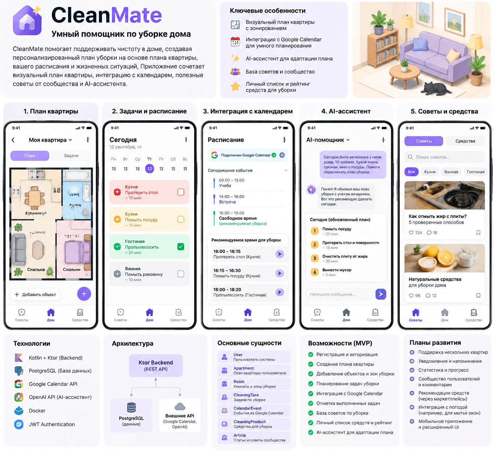

# CleanMate

## Smart Home Cleaning Assistant

CleanMate — это приложение для персонального управления уборкой дома, которое помогает пользователю поддерживать порядок на основе плана квартиры, личного расписания и текущих жизненных ситуаций.

В отличие от обычных приложений со списком задач, CleanMate создаёт цифровую модель квартиры пользователя, учитывает расположение зон уборки, анализирует свободное время в календаре и формирует персональный план действий.

Главная цель проекта — сделать процесс уборки более организованным и автоматизированным, превратив обычный список дел в интеллектуального помощника по управлению домом.

## Идея приложения

Обычные приложения для уборки работают как простой список задач:

```
☐ Помыть пол
☐ Протереть стол
☐ Убраться в ванной
```

CleanMate использует другой подход.

Приложение знает:

- структуру квартиры пользователя;
- какие зоны требуют ухода;
- какие задачи были выполнены;
- когда пользователь свободен;
- какие изменения произошли в доме.

На основе этих данных приложение создаёт индивидуальный план уборки.

Например:

Пользователь сообщает:

> Сегодня была вечеринка, пришло 10 человек, кухня сильно загрязнилась

AI-помощник анализирует ситуацию и изменяет план:

```
Сегодня:
✓ Помыть посуду
✓ Очистить кухонные поверхности
✓ Вынести мусор

Перенесено:
Уборка ванной → завтра
```

## Основные возможности приложения

## Цифровой план квартиры

После регистрации пользователь создаёт виртуальную модель своего дома.

Пользователь может:

- создавать комнаты;
- задавать расположение помещений;
- добавлять мебель и важные зоны;
- указывать места, которые требуют регулярной уборки.

Пример структуры квартиры:

```
Apartment

├── Kitchen
│   ├── Table
│   ├── Sink
│   └── Stove
│
├── Bedroom
│   └── Wardrobe
│
└── Bathroom
    ├── Mirror
    └── Shower
```

Каждая зона квартиры может иметь собственные правила ухода.

Пример:

```
Kitchen Table:
- очистка каждый день

Bathroom Mirror:
- очистка раз в неделю
```

## Умное планирование уборки

CleanMate интегрируется с календарём пользователя.

Поддерживается работа с:

- Google Calendar API;
- внешними календарными сервисами.

Приложение анализирует расписание пользователя и определяет подходящие временные промежутки для уборки.

Пример:

Расписание пользователя:

```
10:00 - 18:00 Работа
19:00 - 20:00 Спорт
```

Свободное время:

```
20:00 - 20:30
```

Приложение формирует план:

```
20:00

Кухня:
- протереть стол
- помыть раковину

Время:
20 минут
```

## Система задач уборки

Для каждой зоны создаются задачи.

Пример:

```
Kitchen

☐ Помыть посуду
☐ Протереть стол
☐ Очистить плиту
```

После выполнения пользователь отмечает задачу:

```
✓ Протереть стол
```

История выполнения сохраняется и используется для формирования будущих планов.

## AI Assistant

В приложении предусмотрен интеллектуальный помощник для адаптации плана уборки.

Пользователь может описать ситуацию обычным текстом.

Пример:

```
Сегодня приходили гости.
Было 8 человек.
Кухня грязная.
```

AI анализирует:

- текущий план квартиры;
- активные задачи;
- состояние зон.

После этого предлагает новый план:

```
Обновлённый план:

1. Убрать кухню
2. Помыть посуду
3. Протереть поверхности
4. Вынести мусор

Обычные задачи перенесены на другой день.
```

## База советов по уборке

В приложении есть раздел с полезными материалами.

Категории:

```
Кухня:
- Как убрать жир с плиты
- Как очистить духовку

Ванная:
- Удаление известкового налёта
- Очистка сантехники
```

Пользователь может:

- читать статьи;
- сохранять полезные материалы;
- оценивать советы.

## Управление средствами для уборки

Пользователь может вести собственную коллекцию средств.

Пример:

```
Название:
Средство для стекол

Оценка:
5/5

Комментарий:
Хорошо убирает разводы
```

Возможности:

- добавление средств;
- рейтинг;
- список необходимых покупок;
- личные заметки.

## Архитектура проекта

Проект разделён на серверную и клиентскую части.

```
CleanMate

├── server
│   └── Ktor Backend
│
├── client
│   └── Application Client
│
└── README.md
```

## Основные сущности системы

### User

Пользователь приложения.

Хранит:

- данные аккаунта;
- настройки;
- подключённые внешние сервисы.

### Apartment

Цифровая модель квартиры пользователя.

Хранит:

- комнаты;
- расположение объектов;
- настройки уборки.

### Room

Комната пользователя.

Примеры:

```
Kitchen
Bedroom
Bathroom
Living Room
```

### CleaningZone

Зона уборки внутри комнаты.

Примеры:

```
Kitchen Table
Bathroom Mirror
Wardrobe
Window
```

### CleaningTask

Задача уборки.

Хранит:

- описание;
- зону;
- периодичность;
- статус выполнения.

Пример:

```
Task:
Clean kitchen table

Frequency:
Every day

Status:
COMPLETED
```

### CalendarEvent

События пользователя из внешнего календаря.

Используются для анализа свободного времени.

### CleaningProduct

Средство для уборки пользователя.

Хранит:

- название;
- рейтинг;
- комментарий.

### Article

Материал из базы советов.

Хранит:

- название;
- текст;
- категорию;
- рейтинг.

## Технологии

Backend:

- Kotlin
- Ktor
- Gradle

Database:

- PostgreSQL

Authentication:

- JWT

External APIs:

- Google Calendar API
- OpenAI API

Infrastructure:

- Docker
- Liquibase/Flyway

## MVP версия

Первая версия приложения включает:

- регистрацию и авторизацию пользователей;
- создание цифровой модели квартиры;
- добавление комнат и зон уборки;
- создание задач уборки;
- отметку выполненных задач;
- интеграцию с календарём пользователя;
- автоматическое формирование плана уборки.

## Возможные улучшения

В будущем возможно добавить:

- распознавание комнат по фотографии;
- автоматическое создание плана квартиры;
- рекомендации средств уборки;
- анализ привычек пользователя;
- поддержку нескольких квартир;
- push-уведомления;
- мобильное приложение;
- голосового помощника.

## Цель проекта

Создать интеллектуального помощника по управлению домом, который помогает пользователю поддерживать порядок без необходимости самостоятельно планировать каждую задачу.

CleanMate объединяет планирование, календарь, персонализацию и искусственный интеллект, создавая единый инструмент для организации домашнего пространства.

